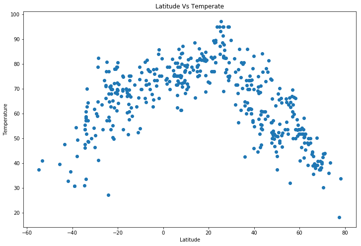

# WeatherPy

## Analysis

### Observed - September 15th 4 AM 

#### 1. Doha city has highest temperature

#### 2. High wind speed Mogadishu SO

#### 3. 68 countries have humidity 100% 


```python
# Dependencies
import json
import requests as req
from citipy import citipy 
import random as r 
import numpy as np
import pandas as pd
import seaborn as sns
import matplotlib.pyplot as plt


```


```python
# Save config information
api_key = "572ecb9cf7bb5d1eccdea81f6bd8913d"
url = "http://api.openweathermap.org/data/2.5/weather?"
```


```python
# defining the required Variables to store the data

coordinates= []
country_name = []
city_name = []
cities = []

city_lat = []
city_lon = []
city_temp = []
city_cloud = []
city_humid = []
city_wind = []

```


```python
# creating a function to generate the different Lat and Lon across the globe 
# by giving the number of rows to be generated

def generate_random_data(num_rows):
    for _ in range(num_rows):
        dec_lat = r.random()/100 + r.randint(-90,90)
        dec_lon = r.random()/100+ r.randint(-90,90)
        #print(lat+dec_lat,lon+dec_lon )
        coordinates.append((dec_lat,dec_lon))
```


```python
# This is to generate the Lat and Lon for the given 1000

generate_random_data(1000)


```


```python
# This to find out the nearest city names for the given randomly generated Lat and Lon

for coordinate_pair in coordinates:
    lat, lon = coordinate_pair
    cities.append(citipy.nearest_city(lat, lon).city_name)

# This is to remove the duplicates of the genereated cities
cities = list(set(cities))

print(len(cities))

```

    463


```python
# This is to generate the url's for the given city to collect the details from openweathermap site 
# This will also print out the urls for the verifications

for city in cities:
    query_url = url + "appid=" + api_key + "&q=" + str(city)+'&units=imperial'
    print()
    print('City No ',cities.index(city),' City Name is ',city)
    print()
    print(query_url)
    
```

    
    City No  0  City Name is  umzimvubu
    
    http://api.openweathermap.org/data/2.5/weather?appid=572ecb9cf7bb5d1eccdea81f6bd8913d&q=umzimvubu&units=imperial
    
    City No  1  City Name is  zaraza
    
    http://api.openweathermap.org/data/2.5/weather?appid=572ecb9cf7bb5d1eccdea81f6bd8913d&q=zaraza&units=imperial
    
    City No  2  City Name is  plyussa
    
    http://api.openweathermap.org/data/2.5/weather?appid=572ecb9cf7bb5d1eccdea81f6bd8913d&q=plyussa&units=imperial
    
    City No  3  City Name is  khangarh
    
    http://api.openweathermap.org/data/2.5/weather?appid=572ecb9cf7bb5d1eccdea81f6bd8913d&q=khangarh&units=imperial
    
    City No  4  City Name is  saurimo
    
    http://api.openweathermap.org/data/2.5/weather?appid=572ecb9cf7bb5d1eccdea81f6bd8913d&q=saurimo&units=imperial
    
    City No  5  City Name is  asuncion
    
    http://api.openweathermap.org/data/2.5/weather?appid=572ecb9cf7bb5d1eccdea81f6bd8913d&q=asuncion&units=imperial
    
    City No  6  City Name is  paso de los toros
    
    http://api.openweathermap.org/data/2.5/weather?appid=572ecb9cf7bb5d1eccdea81f6bd8913d&q=paso de los toros&units=imperial
    
    City No  7  City Name is  aguada de pasajeros
    
    http://api.openweathermap.org/data/2.5/weather?appid=572ecb9cf7bb5d1eccdea81f6bd8913d&q=aguada de pasajeros&units=imperial
    
    City No  8  City Name is  salamiyah
    
    http://api.openweathermap.org/data/2.5/weather?appid=572ecb9cf7bb5d1eccdea81f6bd8913d&q=salamiyah&units=imperial
    
    City No  9  City Name is  hithadhoo
    
    http://api.openweathermap.org/data/2.5/weather?appid=572ecb9cf7bb5d1eccdea81f6bd8913d&q=hithadhoo&units=imperial
    
    City No  10  City Name is  pompeia
    
    http://api.openweathermap.org/data/2.5/weather?appid=572ecb9cf7bb5d1eccdea81f6bd8913d&q=pompeia&units=imperial
    
    City No  11  City Name is  odweyne
    
    http://api.openweathermap.org/data/2.5/weather?appid=572ecb9cf7bb5d1eccdea81f6bd8913d&q=odweyne&units=imperial
    
    City No  12  City Name is  tihemetsa
    
    http://api.openweathermap.org/data/2.5/weather?appid=572ecb9cf7bb5d1eccdea81f6bd8913d&q=tihemetsa&units=imperial
    
    City No  13  City Name is  lagoa
    
    http://api.openweathermap.org/data/2.5/weather?appid=572ecb9cf7bb5d1eccdea81f6bd8913d&q=lagoa&units=imperial
    
    City No  14  City Name is  denizli
    
    http://api.openweathermap.org/data/2.5/weather?appid=572ecb9cf7bb5d1eccdea81f6bd8913d&q=denizli&units=imperial
    
    City No  15  City Name is  banepa
    
    http://api.openweathermap.org/data/2.5/weather?appid=572ecb9cf7bb5d1eccdea81f6bd8913d&q=banepa&units=imperial
    
    City No  16  City Name is  haverhill
    
    http://api.openweathermap.org/data/2.5/weather?appid=572ecb9cf7bb5d1eccdea81f6bd8913d&q=haverhill&units=imperial
    
    City No  17  City Name is  benguela
    
    http://api.openweathermap.org/data/2.5/weather?appid=572ecb9cf7bb5d1eccdea81f6bd8913d&q=benguela&units=imperial
    
    City No  18  City Name is  madimba
    
    http://api.openweathermap.org/data/2.5/weather?appid=572ecb9cf7bb5d1eccdea81f6bd8913d&q=madimba&units=imperial
    
    City No  19  City Name is  iqaluit
    
    http://api.openweathermap.org/data/2.5/weather?appid=572ecb9cf7bb5d1eccdea81f6bd8913d&q=iqaluit&units=imperial
    
    City No  20  City Name is  lima duarte
    
    http://api.openweathermap.org/data/2.5/weather?appid=572ecb9cf7bb5d1eccdea81f6bd8913d&q=lima duarte&units=imperial
    
    City No  21  City Name is  kristiinankaupunki
    
    http://api.openweathermap.org/data/2.5/weather?appid=572ecb9cf7bb5d1eccdea81f6bd8913d&q=kristiinankaupunki&units=imperial
    
    City No  22  City Name is  tsihombe
    
    http://api.openweathermap.org/data/2.5/weather?appid=572ecb9cf7bb5d1eccdea81f6bd8913d&q=tsihombe&units=imperial
    
    City No  23  City Name is  upernavik
    
    http://api.openweathermap.org/data/2.5/weather?appid=572ecb9cf7bb5d1eccdea81f6bd8913d&q=upernavik&units=imperial
    
    City No  24  City Name is  georgetown
    
    http://api.openweathermap.org/data/2.5/weather?appid=572ecb9cf7bb5d1eccdea81f6bd8913d&q=georgetown&units=imperial
    
    City No  25  City Name is  awbari
    
    http://api.openweathermap.org/data/2.5/weather?appid=572ecb9cf7bb5d1eccdea81f6bd8913d&q=awbari&units=imperial
    
    City No  26  City Name is  catamarca
    
    http://api.openweathermap.org/data/2.5/weather?appid=572ecb9cf7bb5d1eccdea81f6bd8913d&q=catamarca&units=imperial
    
    City No  27  City Name is  hrubieszow
    
    http://api.openweathermap.org/data/2.5/weather?appid=572ecb9cf7bb5d1eccdea81f6bd8913d&q=hrubieszow&units=imperial
    
    City No  28  City Name is  bria
    
    http://api.openweathermap.org/data/2.5/weather?appid=572ecb9cf7bb5d1eccdea81f6bd8913d&q=bria&units=imperial
    
    City No  29  City Name is  ipixuna
    
    http://api.openweathermap.org/data/2.5/weather?appid=572ecb9cf7bb5d1eccdea81f6bd8913d&q=ipixuna&units=imperial
    
    City No  30  City Name is  souillac
    
    http://api.openweathermap.org/data/2.5/weather?appid=572ecb9cf7bb5d1eccdea81f6bd8913d&q=souillac&units=imperial
    
    City No  31  City Name is  grindavik
    
    http://api.openweathermap.org/data/2.5/weather?appid=572ecb9cf7bb5d1eccdea81f6bd8913d&q=grindavik&units=imperial
    
    City No  32  City Name is  qibili
    
    http://api.openweathermap.org/data/2.5/weather?appid=572ecb9cf7bb5d1eccdea81f6bd8913d&q=qibili&units=imperial
    
    City No  33  City Name is  talara
    
    http://api.openweathermap.org/data/2.5/weather?appid=572ecb9cf7bb5d1eccdea81f6bd8913d&q=talara&units=imperial
    
    City No  34  City Name is  pitimbu
    
    http://api.openweathermap.org/data/2.5/weather?appid=572ecb9cf7bb5d1eccdea81f6bd8913d&q=pitimbu&units=imperial
    
    City No  35  City Name is  walvis bay
    
    http://api.openweathermap.org/data/2.5/weather?appid=572ecb9cf7bb5d1eccdea81f6bd8913d&q=walvis bay&units=imperial
    
    City No  36  City Name is  tokonou
    
    http://api.openweathermap.org/data/2.5/weather?appid=572ecb9cf7bb5d1eccdea81f6bd8913d&q=tokonou&units=imperial
    
    City No  37  City Name is  sedelnikovo
    
    http://api.openweathermap.org/data/2.5/weather?appid=572ecb9cf7bb5d1eccdea81f6bd8913d&q=sedelnikovo&units=imperial
    
    City No  38  City Name is  vestmannaeyjar
    
    http://api.openweathermap.org/data/2.5/weather?appid=572ecb9cf7bb5d1eccdea81f6bd8913d&q=vestmannaeyjar&units=imperial
    
    City No  39  City Name is  portlethen
    
    http://api.openweathermap.org/data/2.5/weather?appid=572ecb9cf7bb5d1eccdea81f6bd8913d&q=portlethen&units=imperial
    
    City No  40  City Name is  cidreira
    
    http://api.openweathermap.org/data/2.5/weather?appid=572ecb9cf7bb5d1eccdea81f6bd8913d&q=cidreira&units=imperial
    
    City No  41  City Name is  monrovia
    
    http://api.openweathermap.org/data/2.5/weather?appid=572ecb9cf7bb5d1eccdea81f6bd8913d&q=monrovia&units=imperial
    
    City No  42  City Name is  jamestown
    
    http://api.openweathermap.org/data/2.5/weather?appid=572ecb9cf7bb5d1eccdea81f6bd8913d&q=jamestown&units=imperial
    
    City No  43  City Name is  rabo de peixe
    
    http://api.openweathermap.org/data/2.5/weather?appid=572ecb9cf7bb5d1eccdea81f6bd8913d&q=rabo de peixe&units=imperial
    
    City No  44  City Name is  pangody
    
    http://api.openweathermap.org/data/2.5/weather?appid=572ecb9cf7bb5d1eccdea81f6bd8913d&q=pangody&units=imperial
    
    City No  45  City Name is  saint anthony
    
    http://api.openweathermap.org/data/2.5/weather?appid=572ecb9cf7bb5d1eccdea81f6bd8913d&q=saint anthony&units=imperial
    
    City No  46  City Name is  lerwick
    
    http://api.openweathermap.org/data/2.5/weather?appid=572ecb9cf7bb5d1eccdea81f6bd8913d&q=lerwick&units=imperial
    
    City No  47  City Name is  geraldton
    
    http://api.openweathermap.org/data/2.5/weather?appid=572ecb9cf7bb5d1eccdea81f6bd8913d&q=geraldton&units=imperial
    
    City No  48  City Name is  bardiyah
    
    http://api.openweathermap.org/data/2.5/weather?appid=572ecb9cf7bb5d1eccdea81f6bd8913d&q=bardiyah&units=imperial
    
    City No  49  City Name is  vila franca do campo
    
    http://api.openweathermap.org/data/2.5/weather?appid=572ecb9cf7bb5d1eccdea81f6bd8913d&q=vila franca do campo&units=imperial
    
    City No  50  City Name is  nuevitas
    
    http://api.openweathermap.org/data/2.5/weather?appid=572ecb9cf7bb5d1eccdea81f6bd8913d&q=nuevitas&units=imperial
    
    City No  51  City Name is  yarmouth
    
    http://api.openweathermap.org/data/2.5/weather?appid=572ecb9cf7bb5d1eccdea81f6bd8913d&q=yarmouth&units=imperial
    
    City No  52  City Name is  marica
    
    http://api.openweathermap.org/data/2.5/weather?appid=572ecb9cf7bb5d1eccdea81f6bd8913d&q=marica&units=imperial
    
    City No  53  City Name is  mangrol
    
    http://api.openweathermap.org/data/2.5/weather?appid=572ecb9cf7bb5d1eccdea81f6bd8913d&q=mangrol&units=imperial
    
    City No  54  City Name is  colombo
    
    http://api.openweathermap.org/data/2.5/weather?appid=572ecb9cf7bb5d1eccdea81f6bd8913d&q=colombo&units=imperial
    
    City No  55  City Name is  kayerkan
    
    http://api.openweathermap.org/data/2.5/weather?appid=572ecb9cf7bb5d1eccdea81f6bd8913d&q=kayerkan&units=imperial
    
    City No  56  City Name is  rokytne
    
    http://api.openweathermap.org/data/2.5/weather?appid=572ecb9cf7bb5d1eccdea81f6bd8913d&q=rokytne&units=imperial
    
    City No  57  City Name is  kassala
    
    http://api.openweathermap.org/data/2.5/weather?appid=572ecb9cf7bb5d1eccdea81f6bd8913d&q=kassala&units=imperial
    
    City No  58  City Name is  wilmington
    
    http://api.openweathermap.org/data/2.5/weather?appid=572ecb9cf7bb5d1eccdea81f6bd8913d&q=wilmington&units=imperial
    
    City No  59  City Name is  sal rei
    
    http://api.openweathermap.org/data/2.5/weather?appid=572ecb9cf7bb5d1eccdea81f6bd8913d&q=sal rei&units=imperial
    
    City No  60  City Name is  oksfjord
    
    http://api.openweathermap.org/data/2.5/weather?appid=572ecb9cf7bb5d1eccdea81f6bd8913d&q=oksfjord&units=imperial
    
    City No  61  City Name is  juruti
    
    http://api.openweathermap.org/data/2.5/weather?appid=572ecb9cf7bb5d1eccdea81f6bd8913d&q=juruti&units=imperial
    
    City No  62  City Name is  cusuna
    
    http://api.openweathermap.org/data/2.5/weather?appid=572ecb9cf7bb5d1eccdea81f6bd8913d&q=cusuna&units=imperial
    
    City No  63  City Name is  piacabucu
    
    http://api.openweathermap.org/data/2.5/weather?appid=572ecb9cf7bb5d1eccdea81f6bd8913d&q=piacabucu&units=imperial
    
    City No  64  City Name is  huarmey
    
    http://api.openweathermap.org/data/2.5/weather?appid=572ecb9cf7bb5d1eccdea81f6bd8913d&q=huarmey&units=imperial
    
    City No  65  City Name is  natal
    
    http://api.openweathermap.org/data/2.5/weather?appid=572ecb9cf7bb5d1eccdea81f6bd8913d&q=natal&units=imperial
    
    City No  66  City Name is  atbasar
    
    http://api.openweathermap.org/data/2.5/weather?appid=572ecb9cf7bb5d1eccdea81f6bd8913d&q=atbasar&units=imperial
    
    City No  67  City Name is  nanortalik
    
    http://api.openweathermap.org/data/2.5/weather?appid=572ecb9cf7bb5d1eccdea81f6bd8913d&q=nanortalik&units=imperial
    
    City No  68  City Name is  san ramon de la nueva oran
    
    http://api.openweathermap.org/data/2.5/weather?appid=572ecb9cf7bb5d1eccdea81f6bd8913d&q=san ramon de la nueva oran&units=imperial
    
    City No  69  City Name is  qasigiannguit
    
    http://api.openweathermap.org/data/2.5/weather?appid=572ecb9cf7bb5d1eccdea81f6bd8913d&q=qasigiannguit&units=imperial
    
    City No  70  City Name is  sao filipe
    
    http://api.openweathermap.org/data/2.5/weather?appid=572ecb9cf7bb5d1eccdea81f6bd8913d&q=sao filipe&units=imperial
    
    City No  71  City Name is  minas
    
    http://api.openweathermap.org/data/2.5/weather?appid=572ecb9cf7bb5d1eccdea81f6bd8913d&q=minas&units=imperial
    
    City No  72  City Name is  wote
    
    http://api.openweathermap.org/data/2.5/weather?appid=572ecb9cf7bb5d1eccdea81f6bd8913d&q=wote&units=imperial
    
    City No  73  City Name is  agirish
    
    http://api.openweathermap.org/data/2.5/weather?appid=572ecb9cf7bb5d1eccdea81f6bd8913d&q=agirish&units=imperial
    
    City No  74  City Name is  herat
    
    http://api.openweathermap.org/data/2.5/weather?appid=572ecb9cf7bb5d1eccdea81f6bd8913d&q=herat&units=imperial
    
    City No  75  City Name is  acari
    
    http://api.openweathermap.org/data/2.5/weather?appid=572ecb9cf7bb5d1eccdea81f6bd8913d&q=acari&units=imperial
    
    City No  76  City Name is  talavera de la reina
    
    http://api.openweathermap.org/data/2.5/weather?appid=572ecb9cf7bb5d1eccdea81f6bd8913d&q=talavera de la reina&units=imperial
    
    City No  77  City Name is  saint-joseph
    
    http://api.openweathermap.org/data/2.5/weather?appid=572ecb9cf7bb5d1eccdea81f6bd8913d&q=saint-joseph&units=imperial
    
    City No  78  City Name is  marienburg
    
    http://api.openweathermap.org/data/2.5/weather?appid=572ecb9cf7bb5d1eccdea81f6bd8913d&q=marienburg&units=imperial
    
    City No  79  City Name is  basoko
    
    http://api.openweathermap.org/data/2.5/weather?appid=572ecb9cf7bb5d1eccdea81f6bd8913d&q=basoko&units=imperial
    
    City No  80  City Name is  oriximina
    
    http://api.openweathermap.org/data/2.5/weather?appid=572ecb9cf7bb5d1eccdea81f6bd8913d&q=oriximina&units=imperial
    
    City No  81  City Name is  saint-augustin
    
    http://api.openweathermap.org/data/2.5/weather?appid=572ecb9cf7bb5d1eccdea81f6bd8913d&q=saint-augustin&units=imperial
    
    City No  82  City Name is  sinkat
    
    http://api.openweathermap.org/data/2.5/weather?appid=572ecb9cf7bb5d1eccdea81f6bd8913d&q=sinkat&units=imperial
    
    City No  83  City Name is  ilo
    
    http://api.openweathermap.org/data/2.5/weather?appid=572ecb9cf7bb5d1eccdea81f6bd8913d&q=ilo&units=imperial
    
    City No  84  City Name is  rajsamand
    
    http://api.openweathermap.org/data/2.5/weather?appid=572ecb9cf7bb5d1eccdea81f6bd8913d&q=rajsamand&units=imperial
    
    City No  85  City Name is  chitral
    
    http://api.openweathermap.org/data/2.5/weather?appid=572ecb9cf7bb5d1eccdea81f6bd8913d&q=chitral&units=imperial
    
    City No  86  City Name is  grakhovo
    
    http://api.openweathermap.org/data/2.5/weather?appid=572ecb9cf7bb5d1eccdea81f6bd8913d&q=grakhovo&units=imperial
    
    City No  87  City Name is  faya
    
    http://api.openweathermap.org/data/2.5/weather?appid=572ecb9cf7bb5d1eccdea81f6bd8913d&q=faya&units=imperial
    
    City No  88  City Name is  ravar
    
    http://api.openweathermap.org/data/2.5/weather?appid=572ecb9cf7bb5d1eccdea81f6bd8913d&q=ravar&units=imperial
    
    City No  89  City Name is  nalut
    
    http://api.openweathermap.org/data/2.5/weather?appid=572ecb9cf7bb5d1eccdea81f6bd8913d&q=nalut&units=imperial
    
    City No  90  City Name is  riyadh
    
    http://api.openweathermap.org/data/2.5/weather?appid=572ecb9cf7bb5d1eccdea81f6bd8913d&q=riyadh&units=imperial
    
    City No  91  City Name is  scottsburgh
    
    http://api.openweathermap.org/data/2.5/weather?appid=572ecb9cf7bb5d1eccdea81f6bd8913d&q=scottsburgh&units=imperial
    
    City No  92  City Name is  jalu
    
    http://api.openweathermap.org/data/2.5/weather?appid=572ecb9cf7bb5d1eccdea81f6bd8913d&q=jalu&units=imperial
    
    City No  93  City Name is  belushya guba
    
    http://api.openweathermap.org/data/2.5/weather?appid=572ecb9cf7bb5d1eccdea81f6bd8913d&q=belushya guba&units=imperial
    
    City No  94  City Name is  sharjah
    
    http://api.openweathermap.org/data/2.5/weather?appid=572ecb9cf7bb5d1eccdea81f6bd8913d&q=sharjah&units=imperial
    
    City No  95  City Name is  hualmay
    
    http://api.openweathermap.org/data/2.5/weather?appid=572ecb9cf7bb5d1eccdea81f6bd8913d&q=hualmay&units=imperial
    
    City No  96  City Name is  bredasdorp
    
    http://api.openweathermap.org/data/2.5/weather?appid=572ecb9cf7bb5d1eccdea81f6bd8913d&q=bredasdorp&units=imperial
    
    City No  97  City Name is  lauria
    
    http://api.openweathermap.org/data/2.5/weather?appid=572ecb9cf7bb5d1eccdea81f6bd8913d&q=lauria&units=imperial
    
    City No  98  City Name is  high rock
    
    http://api.openweathermap.org/data/2.5/weather?appid=572ecb9cf7bb5d1eccdea81f6bd8913d&q=high rock&units=imperial
    
    City No  99  City Name is  gori
    
    http://api.openweathermap.org/data/2.5/weather?appid=572ecb9cf7bb5d1eccdea81f6bd8913d&q=gori&units=imperial
    
    City No  100  City Name is  tubruq
    
    http://api.openweathermap.org/data/2.5/weather?appid=572ecb9cf7bb5d1eccdea81f6bd8913d&q=tubruq&units=imperial
    
    City No  101  City Name is  tatarsk
    
    http://api.openweathermap.org/data/2.5/weather?appid=572ecb9cf7bb5d1eccdea81f6bd8913d&q=tatarsk&units=imperial
    
    City No  102  City Name is  mumbwa
    
    http://api.openweathermap.org/data/2.5/weather?appid=572ecb9cf7bb5d1eccdea81f6bd8913d&q=mumbwa&units=imperial
    
    City No  103  City Name is  salinas
    
    http://api.openweathermap.org/data/2.5/weather?appid=572ecb9cf7bb5d1eccdea81f6bd8913d&q=salinas&units=imperial
    
    City No  104  City Name is  port alfred
    
    http://api.openweathermap.org/data/2.5/weather?appid=572ecb9cf7bb5d1eccdea81f6bd8913d&q=port alfred&units=imperial
    
    City No  105  City Name is  jujuy
    
    http://api.openweathermap.org/data/2.5/weather?appid=572ecb9cf7bb5d1eccdea81f6bd8913d&q=jujuy&units=imperial
    
    City No  106  City Name is  havelock
    
    http://api.openweathermap.org/data/2.5/weather?appid=572ecb9cf7bb5d1eccdea81f6bd8913d&q=havelock&units=imperial
    
    City No  107  City Name is  malakal
    
    http://api.openweathermap.org/data/2.5/weather?appid=572ecb9cf7bb5d1eccdea81f6bd8913d&q=malakal&units=imperial
    
    City No  108  City Name is  miguelopolis
    
    http://api.openweathermap.org/data/2.5/weather?appid=572ecb9cf7bb5d1eccdea81f6bd8913d&q=miguelopolis&units=imperial
    
    City No  109  City Name is  ceyhan
    
    http://api.openweathermap.org/data/2.5/weather?appid=572ecb9cf7bb5d1eccdea81f6bd8913d&q=ceyhan&units=imperial
    
    City No  110  City Name is  rubiataba
    
    http://api.openweathermap.org/data/2.5/weather?appid=572ecb9cf7bb5d1eccdea81f6bd8913d&q=rubiataba&units=imperial
    
    City No  111  City Name is  san ramon
    
    http://api.openweathermap.org/data/2.5/weather?appid=572ecb9cf7bb5d1eccdea81f6bd8913d&q=san ramon&units=imperial
    
    City No  112  City Name is  amderma
    
    http://api.openweathermap.org/data/2.5/weather?appid=572ecb9cf7bb5d1eccdea81f6bd8913d&q=amderma&units=imperial
    
    City No  113  City Name is  port-gentil
    
    http://api.openweathermap.org/data/2.5/weather?appid=572ecb9cf7bb5d1eccdea81f6bd8913d&q=port-gentil&units=imperial
    
    City No  114  City Name is  taoudenni
    
    http://api.openweathermap.org/data/2.5/weather?appid=572ecb9cf7bb5d1eccdea81f6bd8913d&q=taoudenni&units=imperial
    
    City No  115  City Name is  neuquen
    
    http://api.openweathermap.org/data/2.5/weather?appid=572ecb9cf7bb5d1eccdea81f6bd8913d&q=neuquen&units=imperial
    
    City No  116  City Name is  taolanaro
    
    http://api.openweathermap.org/data/2.5/weather?appid=572ecb9cf7bb5d1eccdea81f6bd8913d&q=taolanaro&units=imperial
    
    City No  117  City Name is  cotoca
    
    http://api.openweathermap.org/data/2.5/weather?appid=572ecb9cf7bb5d1eccdea81f6bd8913d&q=cotoca&units=imperial
    
    City No  118  City Name is  gunupur
    
    http://api.openweathermap.org/data/2.5/weather?appid=572ecb9cf7bb5d1eccdea81f6bd8913d&q=gunupur&units=imperial
    
    City No  119  City Name is  shakawe
    
    http://api.openweathermap.org/data/2.5/weather?appid=572ecb9cf7bb5d1eccdea81f6bd8913d&q=shakawe&units=imperial
    
    City No  120  City Name is  kuznechnoye
    
    http://api.openweathermap.org/data/2.5/weather?appid=572ecb9cf7bb5d1eccdea81f6bd8913d&q=kuznechnoye&units=imperial
    
    City No  121  City Name is  lubango
    
    http://api.openweathermap.org/data/2.5/weather?appid=572ecb9cf7bb5d1eccdea81f6bd8913d&q=lubango&units=imperial
    
    City No  122  City Name is  peniche
    
    http://api.openweathermap.org/data/2.5/weather?appid=572ecb9cf7bb5d1eccdea81f6bd8913d&q=peniche&units=imperial
    
    City No  123  City Name is  grand river south east
    
    http://api.openweathermap.org/data/2.5/weather?appid=572ecb9cf7bb5d1eccdea81f6bd8913d&q=grand river south east&units=imperial
    
    City No  124  City Name is  petlawad
    
    http://api.openweathermap.org/data/2.5/weather?appid=572ecb9cf7bb5d1eccdea81f6bd8913d&q=petlawad&units=imperial
    
    City No  125  City Name is  gulshat
    
    http://api.openweathermap.org/data/2.5/weather?appid=572ecb9cf7bb5d1eccdea81f6bd8913d&q=gulshat&units=imperial
    
    City No  126  City Name is  wajir
    
    http://api.openweathermap.org/data/2.5/weather?appid=572ecb9cf7bb5d1eccdea81f6bd8913d&q=wajir&units=imperial
    
    City No  127  City Name is  puerto carreno
    
    http://api.openweathermap.org/data/2.5/weather?appid=572ecb9cf7bb5d1eccdea81f6bd8913d&q=puerto carreno&units=imperial
    
    City No  128  City Name is  ratnagiri
    
    http://api.openweathermap.org/data/2.5/weather?appid=572ecb9cf7bb5d1eccdea81f6bd8913d&q=ratnagiri&units=imperial
    
    City No  129  City Name is  ancud
    
    http://api.openweathermap.org/data/2.5/weather?appid=572ecb9cf7bb5d1eccdea81f6bd8913d&q=ancud&units=imperial
    
    City No  130  City Name is  hargeysa
    
    http://api.openweathermap.org/data/2.5/weather?appid=572ecb9cf7bb5d1eccdea81f6bd8913d&q=hargeysa&units=imperial
    
    City No  131  City Name is  miracema do tocantins
    
    http://api.openweathermap.org/data/2.5/weather?appid=572ecb9cf7bb5d1eccdea81f6bd8913d&q=miracema do tocantins&units=imperial
    
    City No  132  City Name is  bar-le-duc
    
    http://api.openweathermap.org/data/2.5/weather?appid=572ecb9cf7bb5d1eccdea81f6bd8913d&q=bar-le-duc&units=imperial
    
    City No  133  City Name is  grenada
    
    http://api.openweathermap.org/data/2.5/weather?appid=572ecb9cf7bb5d1eccdea81f6bd8913d&q=grenada&units=imperial
    
    City No  134  City Name is  palasa
    
    http://api.openweathermap.org/data/2.5/weather?appid=572ecb9cf7bb5d1eccdea81f6bd8913d&q=palasa&units=imperial
    
    City No  135  City Name is  tsimlyansk
    
    http://api.openweathermap.org/data/2.5/weather?appid=572ecb9cf7bb5d1eccdea81f6bd8913d&q=tsimlyansk&units=imperial
    
    City No  136  City Name is  ust-koksa
    
    http://api.openweathermap.org/data/2.5/weather?appid=572ecb9cf7bb5d1eccdea81f6bd8913d&q=ust-koksa&units=imperial
    
    City No  137  City Name is  cape town
    
    http://api.openweathermap.org/data/2.5/weather?appid=572ecb9cf7bb5d1eccdea81f6bd8913d&q=cape town&units=imperial
    
    City No  138  City Name is  antofagasta
    
    http://api.openweathermap.org/data/2.5/weather?appid=572ecb9cf7bb5d1eccdea81f6bd8913d&q=antofagasta&units=imperial
    
    City No  139  City Name is  le port
    
    http://api.openweathermap.org/data/2.5/weather?appid=572ecb9cf7bb5d1eccdea81f6bd8913d&q=le port&units=imperial
    
    City No  140  City Name is  villaviciosa
    
    http://api.openweathermap.org/data/2.5/weather?appid=572ecb9cf7bb5d1eccdea81f6bd8913d&q=villaviciosa&units=imperial
    
    City No  141  City Name is  pozo colorado
    
    http://api.openweathermap.org/data/2.5/weather?appid=572ecb9cf7bb5d1eccdea81f6bd8913d&q=pozo colorado&units=imperial
    
    City No  142  City Name is  san cristobal
    
    http://api.openweathermap.org/data/2.5/weather?appid=572ecb9cf7bb5d1eccdea81f6bd8913d&q=san cristobal&units=imperial
    
    City No  143  City Name is  el alto
    
    http://api.openweathermap.org/data/2.5/weather?appid=572ecb9cf7bb5d1eccdea81f6bd8913d&q=el alto&units=imperial
    
    City No  144  City Name is  port elizabeth
    
    http://api.openweathermap.org/data/2.5/weather?appid=572ecb9cf7bb5d1eccdea81f6bd8913d&q=port elizabeth&units=imperial
    
    City No  145  City Name is  plouzane
    
    http://api.openweathermap.org/data/2.5/weather?appid=572ecb9cf7bb5d1eccdea81f6bd8913d&q=plouzane&units=imperial
    
    City No  146  City Name is  mungaa
    
    http://api.openweathermap.org/data/2.5/weather?appid=572ecb9cf7bb5d1eccdea81f6bd8913d&q=mungaa&units=imperial
    
    City No  147  City Name is  clyde river
    
    http://api.openweathermap.org/data/2.5/weather?appid=572ecb9cf7bb5d1eccdea81f6bd8913d&q=clyde river&units=imperial
    
    City No  148  City Name is  busselton
    
    http://api.openweathermap.org/data/2.5/weather?appid=572ecb9cf7bb5d1eccdea81f6bd8913d&q=busselton&units=imperial
    
    City No  149  City Name is  teguise
    
    http://api.openweathermap.org/data/2.5/weather?appid=572ecb9cf7bb5d1eccdea81f6bd8913d&q=teguise&units=imperial
    
    City No  150  City Name is  diamantino
    
    http://api.openweathermap.org/data/2.5/weather?appid=572ecb9cf7bb5d1eccdea81f6bd8913d&q=diamantino&units=imperial
    
    City No  151  City Name is  punta arenas
    
    http://api.openweathermap.org/data/2.5/weather?appid=572ecb9cf7bb5d1eccdea81f6bd8913d&q=punta arenas&units=imperial
    
    City No  152  City Name is  conakry
    
    http://api.openweathermap.org/data/2.5/weather?appid=572ecb9cf7bb5d1eccdea81f6bd8913d&q=conakry&units=imperial
    
    City No  153  City Name is  luena
    
    http://api.openweathermap.org/data/2.5/weather?appid=572ecb9cf7bb5d1eccdea81f6bd8913d&q=luena&units=imperial
    
    City No  154  City Name is  trincomalee
    
    http://api.openweathermap.org/data/2.5/weather?appid=572ecb9cf7bb5d1eccdea81f6bd8913d&q=trincomalee&units=imperial
    
    City No  155  City Name is  coihaique
    
    http://api.openweathermap.org/data/2.5/weather?appid=572ecb9cf7bb5d1eccdea81f6bd8913d&q=coihaique&units=imperial
    
    City No  156  City Name is  espinosa
    
    http://api.openweathermap.org/data/2.5/weather?appid=572ecb9cf7bb5d1eccdea81f6bd8913d&q=espinosa&units=imperial
    
    City No  157  City Name is  mabaruma
    
    http://api.openweathermap.org/data/2.5/weather?appid=572ecb9cf7bb5d1eccdea81f6bd8913d&q=mabaruma&units=imperial
    
    City No  158  City Name is  grafing
    
    http://api.openweathermap.org/data/2.5/weather?appid=572ecb9cf7bb5d1eccdea81f6bd8913d&q=grafing&units=imperial
    
    City No  159  City Name is  corinth
    
    http://api.openweathermap.org/data/2.5/weather?appid=572ecb9cf7bb5d1eccdea81f6bd8913d&q=corinth&units=imperial
    
    City No  160  City Name is  yining
    
    http://api.openweathermap.org/data/2.5/weather?appid=572ecb9cf7bb5d1eccdea81f6bd8913d&q=yining&units=imperial
    
    City No  161  City Name is  mayor pablo lagerenza
    
    http://api.openweathermap.org/data/2.5/weather?appid=572ecb9cf7bb5d1eccdea81f6bd8913d&q=mayor pablo lagerenza&units=imperial
    
    City No  162  City Name is  lyaskelya
    
    http://api.openweathermap.org/data/2.5/weather?appid=572ecb9cf7bb5d1eccdea81f6bd8913d&q=lyaskelya&units=imperial
    
    City No  163  City Name is  coquimbo
    
    http://api.openweathermap.org/data/2.5/weather?appid=572ecb9cf7bb5d1eccdea81f6bd8913d&q=coquimbo&units=imperial
    
    City No  164  City Name is  muros
    
    http://api.openweathermap.org/data/2.5/weather?appid=572ecb9cf7bb5d1eccdea81f6bd8913d&q=muros&units=imperial
    
    City No  165  City Name is  santa cruz de tenerife
    
    http://api.openweathermap.org/data/2.5/weather?appid=572ecb9cf7bb5d1eccdea81f6bd8913d&q=santa cruz de tenerife&units=imperial
    
    City No  166  City Name is  vila velha
    
    http://api.openweathermap.org/data/2.5/weather?appid=572ecb9cf7bb5d1eccdea81f6bd8913d&q=vila velha&units=imperial
    
    City No  167  City Name is  meulaboh
    
    http://api.openweathermap.org/data/2.5/weather?appid=572ecb9cf7bb5d1eccdea81f6bd8913d&q=meulaboh&units=imperial
    
    City No  168  City Name is  malwan
    
    http://api.openweathermap.org/data/2.5/weather?appid=572ecb9cf7bb5d1eccdea81f6bd8913d&q=malwan&units=imperial
    
    City No  169  City Name is  oussouye
    
    http://api.openweathermap.org/data/2.5/weather?appid=572ecb9cf7bb5d1eccdea81f6bd8913d&q=oussouye&units=imperial
    
    City No  170  City Name is  druzhba
    
    http://api.openweathermap.org/data/2.5/weather?appid=572ecb9cf7bb5d1eccdea81f6bd8913d&q=druzhba&units=imperial
    
    City No  171  City Name is  paragominas
    
    http://api.openweathermap.org/data/2.5/weather?appid=572ecb9cf7bb5d1eccdea81f6bd8913d&q=paragominas&units=imperial
    
    City No  172  City Name is  alegrete
    
    http://api.openweathermap.org/data/2.5/weather?appid=572ecb9cf7bb5d1eccdea81f6bd8913d&q=alegrete&units=imperial
    
    City No  173  City Name is  sambava
    
    http://api.openweathermap.org/data/2.5/weather?appid=572ecb9cf7bb5d1eccdea81f6bd8913d&q=sambava&units=imperial
    
    City No  174  City Name is  rheden
    
    http://api.openweathermap.org/data/2.5/weather?appid=572ecb9cf7bb5d1eccdea81f6bd8913d&q=rheden&units=imperial
    
    City No  175  City Name is  saint-pierre
    
    http://api.openweathermap.org/data/2.5/weather?appid=572ecb9cf7bb5d1eccdea81f6bd8913d&q=saint-pierre&units=imperial
    
    City No  176  City Name is  korla
    
    http://api.openweathermap.org/data/2.5/weather?appid=572ecb9cf7bb5d1eccdea81f6bd8913d&q=korla&units=imperial
    
    City No  177  City Name is  andra
    
    http://api.openweathermap.org/data/2.5/weather?appid=572ecb9cf7bb5d1eccdea81f6bd8913d&q=andra&units=imperial
    
    City No  178  City Name is  antalaha
    
    http://api.openweathermap.org/data/2.5/weather?appid=572ecb9cf7bb5d1eccdea81f6bd8913d&q=antalaha&units=imperial
    
    City No  179  City Name is  aktau
    
    http://api.openweathermap.org/data/2.5/weather?appid=572ecb9cf7bb5d1eccdea81f6bd8913d&q=aktau&units=imperial
    
    City No  180  City Name is  richards bay
    
    http://api.openweathermap.org/data/2.5/weather?appid=572ecb9cf7bb5d1eccdea81f6bd8913d&q=richards bay&units=imperial
    
    City No  181  City Name is  victoria
    
    http://api.openweathermap.org/data/2.5/weather?appid=572ecb9cf7bb5d1eccdea81f6bd8913d&q=victoria&units=imperial
    
    City No  182  City Name is  belyy yar
    
    http://api.openweathermap.org/data/2.5/weather?appid=572ecb9cf7bb5d1eccdea81f6bd8913d&q=belyy yar&units=imperial
    
    City No  183  City Name is  salalah
    
    http://api.openweathermap.org/data/2.5/weather?appid=572ecb9cf7bb5d1eccdea81f6bd8913d&q=salalah&units=imperial
    
    City No  184  City Name is  macau
    
    http://api.openweathermap.org/data/2.5/weather?appid=572ecb9cf7bb5d1eccdea81f6bd8913d&q=macau&units=imperial
    
    City No  185  City Name is  itapirapua
    
    http://api.openweathermap.org/data/2.5/weather?appid=572ecb9cf7bb5d1eccdea81f6bd8913d&q=itapirapua&units=imperial
    
    City No  186  City Name is  wukari
    
    http://api.openweathermap.org/data/2.5/weather?appid=572ecb9cf7bb5d1eccdea81f6bd8913d&q=wukari&units=imperial
    
    City No  187  City Name is  attawapiskat
    
    http://api.openweathermap.org/data/2.5/weather?appid=572ecb9cf7bb5d1eccdea81f6bd8913d&q=attawapiskat&units=imperial
    
    City No  188  City Name is  olafsvik
    
    http://api.openweathermap.org/data/2.5/weather?appid=572ecb9cf7bb5d1eccdea81f6bd8913d&q=olafsvik&units=imperial
    
    City No  189  City Name is  zhanakorgan
    
    http://api.openweathermap.org/data/2.5/weather?appid=572ecb9cf7bb5d1eccdea81f6bd8913d&q=zhanakorgan&units=imperial
    
    City No  190  City Name is  boa vista
    
    http://api.openweathermap.org/data/2.5/weather?appid=572ecb9cf7bb5d1eccdea81f6bd8913d&q=boa vista&units=imperial
    
    City No  191  City Name is  mehamn
    
    http://api.openweathermap.org/data/2.5/weather?appid=572ecb9cf7bb5d1eccdea81f6bd8913d&q=mehamn&units=imperial
    
    City No  192  City Name is  plettenberg bay
    
    http://api.openweathermap.org/data/2.5/weather?appid=572ecb9cf7bb5d1eccdea81f6bd8913d&q=plettenberg bay&units=imperial
    
    City No  193  City Name is  buraydah
    
    http://api.openweathermap.org/data/2.5/weather?appid=572ecb9cf7bb5d1eccdea81f6bd8913d&q=buraydah&units=imperial
    
    City No  194  City Name is  iralaya
    
    http://api.openweathermap.org/data/2.5/weather?appid=572ecb9cf7bb5d1eccdea81f6bd8913d&q=iralaya&units=imperial
    
    City No  195  City Name is  carnarvon
    
    http://api.openweathermap.org/data/2.5/weather?appid=572ecb9cf7bb5d1eccdea81f6bd8913d&q=carnarvon&units=imperial
    
    City No  196  City Name is  mocambique
    
    http://api.openweathermap.org/data/2.5/weather?appid=572ecb9cf7bb5d1eccdea81f6bd8913d&q=mocambique&units=imperial
    
    City No  197  City Name is  berlevag
    
    http://api.openweathermap.org/data/2.5/weather?appid=572ecb9cf7bb5d1eccdea81f6bd8913d&q=berlevag&units=imperial
    
    City No  198  City Name is  salekhard
    
    http://api.openweathermap.org/data/2.5/weather?appid=572ecb9cf7bb5d1eccdea81f6bd8913d&q=salekhard&units=imperial
    
    City No  199  City Name is  san rafael
    
    http://api.openweathermap.org/data/2.5/weather?appid=572ecb9cf7bb5d1eccdea81f6bd8913d&q=san rafael&units=imperial
    
    City No  200  City Name is  castro
    
    http://api.openweathermap.org/data/2.5/weather?appid=572ecb9cf7bb5d1eccdea81f6bd8913d&q=castro&units=imperial
    
    City No  201  City Name is  severnyy
    
    http://api.openweathermap.org/data/2.5/weather?appid=572ecb9cf7bb5d1eccdea81f6bd8913d&q=severnyy&units=imperial
    
    City No  202  City Name is  omboue
    
    http://api.openweathermap.org/data/2.5/weather?appid=572ecb9cf7bb5d1eccdea81f6bd8913d&q=omboue&units=imperial
    
    City No  203  City Name is  maniitsoq
    
    http://api.openweathermap.org/data/2.5/weather?appid=572ecb9cf7bb5d1eccdea81f6bd8913d&q=maniitsoq&units=imperial
    
    City No  204  City Name is  thompson
    
    http://api.openweathermap.org/data/2.5/weather?appid=572ecb9cf7bb5d1eccdea81f6bd8913d&q=thompson&units=imperial
    
    City No  205  City Name is  paamiut
    
    http://api.openweathermap.org/data/2.5/weather?appid=572ecb9cf7bb5d1eccdea81f6bd8913d&q=paamiut&units=imperial
    
    City No  206  City Name is  eyl
    
    http://api.openweathermap.org/data/2.5/weather?appid=572ecb9cf7bb5d1eccdea81f6bd8913d&q=eyl&units=imperial
    
    City No  207  City Name is  akyab
    
    http://api.openweathermap.org/data/2.5/weather?appid=572ecb9cf7bb5d1eccdea81f6bd8913d&q=akyab&units=imperial
    
    City No  208  City Name is  conde
    
    http://api.openweathermap.org/data/2.5/weather?appid=572ecb9cf7bb5d1eccdea81f6bd8913d&q=conde&units=imperial
    
    City No  209  City Name is  zanjan
    
    http://api.openweathermap.org/data/2.5/weather?appid=572ecb9cf7bb5d1eccdea81f6bd8913d&q=zanjan&units=imperial
    
    City No  210  City Name is  karaton
    
    http://api.openweathermap.org/data/2.5/weather?appid=572ecb9cf7bb5d1eccdea81f6bd8913d&q=karaton&units=imperial
    
    City No  211  City Name is  chuy
    
    http://api.openweathermap.org/data/2.5/weather?appid=572ecb9cf7bb5d1eccdea81f6bd8913d&q=chuy&units=imperial
    
    City No  212  City Name is  karamay
    
    http://api.openweathermap.org/data/2.5/weather?appid=572ecb9cf7bb5d1eccdea81f6bd8913d&q=karamay&units=imperial
    
    City No  213  City Name is  camargo
    
    http://api.openweathermap.org/data/2.5/weather?appid=572ecb9cf7bb5d1eccdea81f6bd8913d&q=camargo&units=imperial
    
    City No  214  City Name is  viramgam
    
    http://api.openweathermap.org/data/2.5/weather?appid=572ecb9cf7bb5d1eccdea81f6bd8913d&q=viramgam&units=imperial
    
    City No  215  City Name is  harper
    
    http://api.openweathermap.org/data/2.5/weather?appid=572ecb9cf7bb5d1eccdea81f6bd8913d&q=harper&units=imperial
    
    City No  216  City Name is  luderitz
    
    http://api.openweathermap.org/data/2.5/weather?appid=572ecb9cf7bb5d1eccdea81f6bd8913d&q=luderitz&units=imperial
    
    City No  217  City Name is  boyuibe
    
    http://api.openweathermap.org/data/2.5/weather?appid=572ecb9cf7bb5d1eccdea81f6bd8913d&q=boyuibe&units=imperial
    
    City No  218  City Name is  oum hadjer
    
    http://api.openweathermap.org/data/2.5/weather?appid=572ecb9cf7bb5d1eccdea81f6bd8913d&q=oum hadjer&units=imperial
    
    City No  219  City Name is  pedernales
    
    http://api.openweathermap.org/data/2.5/weather?appid=572ecb9cf7bb5d1eccdea81f6bd8913d&q=pedernales&units=imperial
    
    City No  220  City Name is  lagos
    
    http://api.openweathermap.org/data/2.5/weather?appid=572ecb9cf7bb5d1eccdea81f6bd8913d&q=lagos&units=imperial
    
    City No  221  City Name is  macamic
    
    http://api.openweathermap.org/data/2.5/weather?appid=572ecb9cf7bb5d1eccdea81f6bd8913d&q=macamic&units=imperial
    
    City No  222  City Name is  viedma
    
    http://api.openweathermap.org/data/2.5/weather?appid=572ecb9cf7bb5d1eccdea81f6bd8913d&q=viedma&units=imperial
    
    City No  223  City Name is  itaituba
    
    http://api.openweathermap.org/data/2.5/weather?appid=572ecb9cf7bb5d1eccdea81f6bd8913d&q=itaituba&units=imperial
    
    City No  224  City Name is  hearst
    
    http://api.openweathermap.org/data/2.5/weather?appid=572ecb9cf7bb5d1eccdea81f6bd8913d&q=hearst&units=imperial
    
    City No  225  City Name is  jaisalmer
    
    http://api.openweathermap.org/data/2.5/weather?appid=572ecb9cf7bb5d1eccdea81f6bd8913d&q=jaisalmer&units=imperial
    
    City No  226  City Name is  darbhanga
    
    http://api.openweathermap.org/data/2.5/weather?appid=572ecb9cf7bb5d1eccdea81f6bd8913d&q=darbhanga&units=imperial
    
    City No  227  City Name is  narsaq
    
    http://api.openweathermap.org/data/2.5/weather?appid=572ecb9cf7bb5d1eccdea81f6bd8913d&q=narsaq&units=imperial
    
    City No  228  City Name is  yarada
    
    http://api.openweathermap.org/data/2.5/weather?appid=572ecb9cf7bb5d1eccdea81f6bd8913d&q=yarada&units=imperial
    
    City No  229  City Name is  ghanzi
    
    http://api.openweathermap.org/data/2.5/weather?appid=572ecb9cf7bb5d1eccdea81f6bd8913d&q=ghanzi&units=imperial
    
    City No  230  City Name is  caravelas
    
    http://api.openweathermap.org/data/2.5/weather?appid=572ecb9cf7bb5d1eccdea81f6bd8913d&q=caravelas&units=imperial
    
    City No  231  City Name is  volokolamsk
    
    http://api.openweathermap.org/data/2.5/weather?appid=572ecb9cf7bb5d1eccdea81f6bd8913d&q=volokolamsk&units=imperial
    
    City No  232  City Name is  babanusah
    
    http://api.openweathermap.org/data/2.5/weather?appid=572ecb9cf7bb5d1eccdea81f6bd8913d&q=babanusah&units=imperial
    
    City No  233  City Name is  rorvik
    
    http://api.openweathermap.org/data/2.5/weather?appid=572ecb9cf7bb5d1eccdea81f6bd8913d&q=rorvik&units=imperial
    
    City No  234  City Name is  phalaborwa
    
    http://api.openweathermap.org/data/2.5/weather?appid=572ecb9cf7bb5d1eccdea81f6bd8913d&q=phalaborwa&units=imperial
    
    City No  235  City Name is  morlaix
    
    http://api.openweathermap.org/data/2.5/weather?appid=572ecb9cf7bb5d1eccdea81f6bd8913d&q=morlaix&units=imperial
    
    City No  236  City Name is  ilulissat
    
    http://api.openweathermap.org/data/2.5/weather?appid=572ecb9cf7bb5d1eccdea81f6bd8913d&q=ilulissat&units=imperial
    
    City No  237  City Name is  valparaiso
    
    http://api.openweathermap.org/data/2.5/weather?appid=572ecb9cf7bb5d1eccdea81f6bd8913d&q=valparaiso&units=imperial
    
    City No  238  City Name is  mao
    
    http://api.openweathermap.org/data/2.5/weather?appid=572ecb9cf7bb5d1eccdea81f6bd8913d&q=mao&units=imperial
    
    City No  239  City Name is  tawnat
    
    http://api.openweathermap.org/data/2.5/weather?appid=572ecb9cf7bb5d1eccdea81f6bd8913d&q=tawnat&units=imperial
    
    City No  240  City Name is  uige
    
    http://api.openweathermap.org/data/2.5/weather?appid=572ecb9cf7bb5d1eccdea81f6bd8913d&q=uige&units=imperial
    
    City No  241  City Name is  bakchar
    
    http://api.openweathermap.org/data/2.5/weather?appid=572ecb9cf7bb5d1eccdea81f6bd8913d&q=bakchar&units=imperial
    
    City No  242  City Name is  barinas
    
    http://api.openweathermap.org/data/2.5/weather?appid=572ecb9cf7bb5d1eccdea81f6bd8913d&q=barinas&units=imperial
    
    City No  243  City Name is  chapais
    
    http://api.openweathermap.org/data/2.5/weather?appid=572ecb9cf7bb5d1eccdea81f6bd8913d&q=chapais&units=imperial
    
    City No  244  City Name is  rawson
    
    http://api.openweathermap.org/data/2.5/weather?appid=572ecb9cf7bb5d1eccdea81f6bd8913d&q=rawson&units=imperial
    
    City No  245  City Name is  bonthe
    
    http://api.openweathermap.org/data/2.5/weather?appid=572ecb9cf7bb5d1eccdea81f6bd8913d&q=bonthe&units=imperial
    
    City No  246  City Name is  lixourion
    
    http://api.openweathermap.org/data/2.5/weather?appid=572ecb9cf7bb5d1eccdea81f6bd8913d&q=lixourion&units=imperial
    
    City No  247  City Name is  biu
    
    http://api.openweathermap.org/data/2.5/weather?appid=572ecb9cf7bb5d1eccdea81f6bd8913d&q=biu&units=imperial
    
    City No  248  City Name is  aras
    
    http://api.openweathermap.org/data/2.5/weather?appid=572ecb9cf7bb5d1eccdea81f6bd8913d&q=aras&units=imperial
    
    City No  249  City Name is  guane
    
    http://api.openweathermap.org/data/2.5/weather?appid=572ecb9cf7bb5d1eccdea81f6bd8913d&q=guane&units=imperial
    
    City No  250  City Name is  amambai
    
    http://api.openweathermap.org/data/2.5/weather?appid=572ecb9cf7bb5d1eccdea81f6bd8913d&q=amambai&units=imperial
    
    City No  251  City Name is  tuzha
    
    http://api.openweathermap.org/data/2.5/weather?appid=572ecb9cf7bb5d1eccdea81f6bd8913d&q=tuzha&units=imperial
    
    City No  252  City Name is  kota
    
    http://api.openweathermap.org/data/2.5/weather?appid=572ecb9cf7bb5d1eccdea81f6bd8913d&q=kota&units=imperial
    
    City No  253  City Name is  maloy
    
    http://api.openweathermap.org/data/2.5/weather?appid=572ecb9cf7bb5d1eccdea81f6bd8913d&q=maloy&units=imperial
    
    City No  254  City Name is  yendi
    
    http://api.openweathermap.org/data/2.5/weather?appid=572ecb9cf7bb5d1eccdea81f6bd8913d&q=yendi&units=imperial
    
    City No  255  City Name is  barbar
    
    http://api.openweathermap.org/data/2.5/weather?appid=572ecb9cf7bb5d1eccdea81f6bd8913d&q=barbar&units=imperial
    
    City No  256  City Name is  tolosa
    
    http://api.openweathermap.org/data/2.5/weather?appid=572ecb9cf7bb5d1eccdea81f6bd8913d&q=tolosa&units=imperial
    
    City No  257  City Name is  barra do garcas
    
    http://api.openweathermap.org/data/2.5/weather?appid=572ecb9cf7bb5d1eccdea81f6bd8913d&q=barra do garcas&units=imperial
    
    City No  258  City Name is  bandar-e lengeh
    
    http://api.openweathermap.org/data/2.5/weather?appid=572ecb9cf7bb5d1eccdea81f6bd8913d&q=bandar-e lengeh&units=imperial
    
    City No  259  City Name is  la malbaie
    
    http://api.openweathermap.org/data/2.5/weather?appid=572ecb9cf7bb5d1eccdea81f6bd8913d&q=la malbaie&units=imperial
    
    City No  260  City Name is  viligili
    
    http://api.openweathermap.org/data/2.5/weather?appid=572ecb9cf7bb5d1eccdea81f6bd8913d&q=viligili&units=imperial
    
    City No  261  City Name is  savelugu
    
    http://api.openweathermap.org/data/2.5/weather?appid=572ecb9cf7bb5d1eccdea81f6bd8913d&q=savelugu&units=imperial
    
    City No  262  City Name is  kotka
    
    http://api.openweathermap.org/data/2.5/weather?appid=572ecb9cf7bb5d1eccdea81f6bd8913d&q=kotka&units=imperial
    
    City No  263  City Name is  uruzgan
    
    http://api.openweathermap.org/data/2.5/weather?appid=572ecb9cf7bb5d1eccdea81f6bd8913d&q=uruzgan&units=imperial
    
    City No  264  City Name is  jacareacanga
    
    http://api.openweathermap.org/data/2.5/weather?appid=572ecb9cf7bb5d1eccdea81f6bd8913d&q=jacareacanga&units=imperial
    
    City No  265  City Name is  hillsborough
    
    http://api.openweathermap.org/data/2.5/weather?appid=572ecb9cf7bb5d1eccdea81f6bd8913d&q=hillsborough&units=imperial
    
    City No  266  City Name is  pisco
    
    http://api.openweathermap.org/data/2.5/weather?appid=572ecb9cf7bb5d1eccdea81f6bd8913d&q=pisco&units=imperial
    
    City No  267  City Name is  mantua
    
    http://api.openweathermap.org/data/2.5/weather?appid=572ecb9cf7bb5d1eccdea81f6bd8913d&q=mantua&units=imperial
    
    City No  268  City Name is  sukhoy log
    
    http://api.openweathermap.org/data/2.5/weather?appid=572ecb9cf7bb5d1eccdea81f6bd8913d&q=sukhoy log&units=imperial
    
    City No  269  City Name is  illoqqortoormiut
    
    http://api.openweathermap.org/data/2.5/weather?appid=572ecb9cf7bb5d1eccdea81f6bd8913d&q=illoqqortoormiut&units=imperial
    
    City No  270  City Name is  ciudad bolivar
    
    http://api.openweathermap.org/data/2.5/weather?appid=572ecb9cf7bb5d1eccdea81f6bd8913d&q=ciudad bolivar&units=imperial
    
    City No  271  City Name is  soyo
    
    http://api.openweathermap.org/data/2.5/weather?appid=572ecb9cf7bb5d1eccdea81f6bd8913d&q=soyo&units=imperial
    
    City No  272  City Name is  marawi
    
    http://api.openweathermap.org/data/2.5/weather?appid=572ecb9cf7bb5d1eccdea81f6bd8913d&q=marawi&units=imperial
    
    City No  273  City Name is  anuradhapura
    
    http://api.openweathermap.org/data/2.5/weather?appid=572ecb9cf7bb5d1eccdea81f6bd8913d&q=anuradhapura&units=imperial
    
    City No  274  City Name is  cascais
    
    http://api.openweathermap.org/data/2.5/weather?appid=572ecb9cf7bb5d1eccdea81f6bd8913d&q=cascais&units=imperial
    
    City No  275  City Name is  goderich
    
    http://api.openweathermap.org/data/2.5/weather?appid=572ecb9cf7bb5d1eccdea81f6bd8913d&q=goderich&units=imperial
    
    City No  276  City Name is  ndele
    
    http://api.openweathermap.org/data/2.5/weather?appid=572ecb9cf7bb5d1eccdea81f6bd8913d&q=ndele&units=imperial
    
    City No  277  City Name is  codrington
    
    http://api.openweathermap.org/data/2.5/weather?appid=572ecb9cf7bb5d1eccdea81f6bd8913d&q=codrington&units=imperial
    
    City No  278  City Name is  beloha
    
    http://api.openweathermap.org/data/2.5/weather?appid=572ecb9cf7bb5d1eccdea81f6bd8913d&q=beloha&units=imperial
    
    City No  279  City Name is  black river
    
    http://api.openweathermap.org/data/2.5/weather?appid=572ecb9cf7bb5d1eccdea81f6bd8913d&q=black river&units=imperial
    
    City No  280  City Name is  sahrak
    
    http://api.openweathermap.org/data/2.5/weather?appid=572ecb9cf7bb5d1eccdea81f6bd8913d&q=sahrak&units=imperial
    
    City No  281  City Name is  stornoway
    
    http://api.openweathermap.org/data/2.5/weather?appid=572ecb9cf7bb5d1eccdea81f6bd8913d&q=stornoway&units=imperial
    
    City No  282  City Name is  kambove
    
    http://api.openweathermap.org/data/2.5/weather?appid=572ecb9cf7bb5d1eccdea81f6bd8913d&q=kambove&units=imperial
    
    City No  283  City Name is  sukhobezvodnoye
    
    http://api.openweathermap.org/data/2.5/weather?appid=572ecb9cf7bb5d1eccdea81f6bd8913d&q=sukhobezvodnoye&units=imperial
    
    City No  284  City Name is  saint george
    
    http://api.openweathermap.org/data/2.5/weather?appid=572ecb9cf7bb5d1eccdea81f6bd8913d&q=saint george&units=imperial
    
    City No  285  City Name is  rocha
    
    http://api.openweathermap.org/data/2.5/weather?appid=572ecb9cf7bb5d1eccdea81f6bd8913d&q=rocha&units=imperial
    
    City No  286  City Name is  arlit
    
    http://api.openweathermap.org/data/2.5/weather?appid=572ecb9cf7bb5d1eccdea81f6bd8913d&q=arlit&units=imperial
    
    City No  287  City Name is  kavaratti
    
    http://api.openweathermap.org/data/2.5/weather?appid=572ecb9cf7bb5d1eccdea81f6bd8913d&q=kavaratti&units=imperial
    
    City No  288  City Name is  bushehr
    
    http://api.openweathermap.org/data/2.5/weather?appid=572ecb9cf7bb5d1eccdea81f6bd8913d&q=bushehr&units=imperial
    
    City No  289  City Name is  the valley
    
    http://api.openweathermap.org/data/2.5/weather?appid=572ecb9cf7bb5d1eccdea81f6bd8913d&q=the valley&units=imperial
    
    City No  290  City Name is  aksum
    
    http://api.openweathermap.org/data/2.5/weather?appid=572ecb9cf7bb5d1eccdea81f6bd8913d&q=aksum&units=imperial
    
    City No  291  City Name is  badnawar
    
    http://api.openweathermap.org/data/2.5/weather?appid=572ecb9cf7bb5d1eccdea81f6bd8913d&q=badnawar&units=imperial
    
    City No  292  City Name is  thunder bay
    
    http://api.openweathermap.org/data/2.5/weather?appid=572ecb9cf7bb5d1eccdea81f6bd8913d&q=thunder bay&units=imperial
    
    City No  293  City Name is  voghera
    
    http://api.openweathermap.org/data/2.5/weather?appid=572ecb9cf7bb5d1eccdea81f6bd8913d&q=voghera&units=imperial
    
    City No  294  City Name is  kiruna
    
    http://api.openweathermap.org/data/2.5/weather?appid=572ecb9cf7bb5d1eccdea81f6bd8913d&q=kiruna&units=imperial
    
    City No  295  City Name is  araguaina
    
    http://api.openweathermap.org/data/2.5/weather?appid=572ecb9cf7bb5d1eccdea81f6bd8913d&q=araguaina&units=imperial
    
    City No  296  City Name is  sisimiut
    
    http://api.openweathermap.org/data/2.5/weather?appid=572ecb9cf7bb5d1eccdea81f6bd8913d&q=sisimiut&units=imperial
    
    City No  297  City Name is  tocopilla
    
    http://api.openweathermap.org/data/2.5/weather?appid=572ecb9cf7bb5d1eccdea81f6bd8913d&q=tocopilla&units=imperial
    
    City No  298  City Name is  dzhusaly
    
    http://api.openweathermap.org/data/2.5/weather?appid=572ecb9cf7bb5d1eccdea81f6bd8913d&q=dzhusaly&units=imperial
    
    City No  299  City Name is  esna
    
    http://api.openweathermap.org/data/2.5/weather?appid=572ecb9cf7bb5d1eccdea81f6bd8913d&q=esna&units=imperial
    
    City No  300  City Name is  pilar
    
    http://api.openweathermap.org/data/2.5/weather?appid=572ecb9cf7bb5d1eccdea81f6bd8913d&q=pilar&units=imperial
    
    City No  301  City Name is  bud
    
    http://api.openweathermap.org/data/2.5/weather?appid=572ecb9cf7bb5d1eccdea81f6bd8913d&q=bud&units=imperial
    
    City No  302  City Name is  igarka
    
    http://api.openweathermap.org/data/2.5/weather?appid=572ecb9cf7bb5d1eccdea81f6bd8913d&q=igarka&units=imperial
    
    City No  303  City Name is  klaksvik
    
    http://api.openweathermap.org/data/2.5/weather?appid=572ecb9cf7bb5d1eccdea81f6bd8913d&q=klaksvik&units=imperial
    
    City No  304  City Name is  murdochville
    
    http://api.openweathermap.org/data/2.5/weather?appid=572ecb9cf7bb5d1eccdea81f6bd8913d&q=murdochville&units=imperial
    
    City No  305  City Name is  general roca
    
    http://api.openweathermap.org/data/2.5/weather?appid=572ecb9cf7bb5d1eccdea81f6bd8913d&q=general roca&units=imperial
    
    City No  306  City Name is  bay roberts
    
    http://api.openweathermap.org/data/2.5/weather?appid=572ecb9cf7bb5d1eccdea81f6bd8913d&q=bay roberts&units=imperial
    
    City No  307  City Name is  virginia beach
    
    http://api.openweathermap.org/data/2.5/weather?appid=572ecb9cf7bb5d1eccdea81f6bd8913d&q=virginia beach&units=imperial
    
    City No  308  City Name is  tigre
    
    http://api.openweathermap.org/data/2.5/weather?appid=572ecb9cf7bb5d1eccdea81f6bd8913d&q=tigre&units=imperial
    
    City No  309  City Name is  charagua
    
    http://api.openweathermap.org/data/2.5/weather?appid=572ecb9cf7bb5d1eccdea81f6bd8913d&q=charagua&units=imperial
    
    City No  310  City Name is  praia da vitoria
    
    http://api.openweathermap.org/data/2.5/weather?appid=572ecb9cf7bb5d1eccdea81f6bd8913d&q=praia da vitoria&units=imperial
    
    City No  311  City Name is  crossville
    
    http://api.openweathermap.org/data/2.5/weather?appid=572ecb9cf7bb5d1eccdea81f6bd8913d&q=crossville&units=imperial
    
    City No  312  City Name is  henties bay
    
    http://api.openweathermap.org/data/2.5/weather?appid=572ecb9cf7bb5d1eccdea81f6bd8913d&q=henties bay&units=imperial
    
    City No  313  City Name is  arraial do cabo
    
    http://api.openweathermap.org/data/2.5/weather?appid=572ecb9cf7bb5d1eccdea81f6bd8913d&q=arraial do cabo&units=imperial
    
    City No  314  City Name is  marsh harbour
    
    http://api.openweathermap.org/data/2.5/weather?appid=572ecb9cf7bb5d1eccdea81f6bd8913d&q=marsh harbour&units=imperial
    
    City No  315  City Name is  karpathos
    
    http://api.openweathermap.org/data/2.5/weather?appid=572ecb9cf7bb5d1eccdea81f6bd8913d&q=karpathos&units=imperial
    
    City No  316  City Name is  rudnya
    
    http://api.openweathermap.org/data/2.5/weather?appid=572ecb9cf7bb5d1eccdea81f6bd8913d&q=rudnya&units=imperial
    
    City No  317  City Name is  loanda
    
    http://api.openweathermap.org/data/2.5/weather?appid=572ecb9cf7bb5d1eccdea81f6bd8913d&q=loanda&units=imperial
    
    City No  318  City Name is  chipinge
    
    http://api.openweathermap.org/data/2.5/weather?appid=572ecb9cf7bb5d1eccdea81f6bd8913d&q=chipinge&units=imperial
    
    City No  319  City Name is  mar del plata
    
    http://api.openweathermap.org/data/2.5/weather?appid=572ecb9cf7bb5d1eccdea81f6bd8913d&q=mar del plata&units=imperial
    
    City No  320  City Name is  atar
    
    http://api.openweathermap.org/data/2.5/weather?appid=572ecb9cf7bb5d1eccdea81f6bd8913d&q=atar&units=imperial
    
    City No  321  City Name is  kalabo
    
    http://api.openweathermap.org/data/2.5/weather?appid=572ecb9cf7bb5d1eccdea81f6bd8913d&q=kalabo&units=imperial
    
    City No  322  City Name is  sao joao da ponte
    
    http://api.openweathermap.org/data/2.5/weather?appid=572ecb9cf7bb5d1eccdea81f6bd8913d&q=sao joao da ponte&units=imperial
    
    City No  323  City Name is  longyearbyen
    
    http://api.openweathermap.org/data/2.5/weather?appid=572ecb9cf7bb5d1eccdea81f6bd8913d&q=longyearbyen&units=imperial
    
    City No  324  City Name is  kuche
    
    http://api.openweathermap.org/data/2.5/weather?appid=572ecb9cf7bb5d1eccdea81f6bd8913d&q=kuche&units=imperial
    
    City No  325  City Name is  puerto quijarro
    
    http://api.openweathermap.org/data/2.5/weather?appid=572ecb9cf7bb5d1eccdea81f6bd8913d&q=puerto quijarro&units=imperial
    
    City No  326  City Name is  laguna
    
    http://api.openweathermap.org/data/2.5/weather?appid=572ecb9cf7bb5d1eccdea81f6bd8913d&q=laguna&units=imperial
    
    City No  327  City Name is  ostrovnoy
    
    http://api.openweathermap.org/data/2.5/weather?appid=572ecb9cf7bb5d1eccdea81f6bd8913d&q=ostrovnoy&units=imperial
    
    City No  328  City Name is  cayenne
    
    http://api.openweathermap.org/data/2.5/weather?appid=572ecb9cf7bb5d1eccdea81f6bd8913d&q=cayenne&units=imperial
    
    City No  329  City Name is  cockburn harbour
    
    http://api.openweathermap.org/data/2.5/weather?appid=572ecb9cf7bb5d1eccdea81f6bd8913d&q=cockburn harbour&units=imperial
    
    City No  330  City Name is  ippy
    
    http://api.openweathermap.org/data/2.5/weather?appid=572ecb9cf7bb5d1eccdea81f6bd8913d&q=ippy&units=imperial
    
    City No  331  City Name is  gamba
    
    http://api.openweathermap.org/data/2.5/weather?appid=572ecb9cf7bb5d1eccdea81f6bd8913d&q=gamba&units=imperial
    
    City No  332  City Name is  talalayivka
    
    http://api.openweathermap.org/data/2.5/weather?appid=572ecb9cf7bb5d1eccdea81f6bd8913d&q=talalayivka&units=imperial
    
    City No  333  City Name is  los llanos de aridane
    
    http://api.openweathermap.org/data/2.5/weather?appid=572ecb9cf7bb5d1eccdea81f6bd8913d&q=los llanos de aridane&units=imperial
    
    City No  334  City Name is  ionia
    
    http://api.openweathermap.org/data/2.5/weather?appid=572ecb9cf7bb5d1eccdea81f6bd8913d&q=ionia&units=imperial
    
    City No  335  City Name is  torbay
    
    http://api.openweathermap.org/data/2.5/weather?appid=572ecb9cf7bb5d1eccdea81f6bd8913d&q=torbay&units=imperial
    
    City No  336  City Name is  norrtalje
    
    http://api.openweathermap.org/data/2.5/weather?appid=572ecb9cf7bb5d1eccdea81f6bd8913d&q=norrtalje&units=imperial
    
    City No  337  City Name is  skagastrond
    
    http://api.openweathermap.org/data/2.5/weather?appid=572ecb9cf7bb5d1eccdea81f6bd8913d&q=skagastrond&units=imperial
    
    City No  338  City Name is  sorvag
    
    http://api.openweathermap.org/data/2.5/weather?appid=572ecb9cf7bb5d1eccdea81f6bd8913d&q=sorvag&units=imperial
    
    City No  339  City Name is  grand gaube
    
    http://api.openweathermap.org/data/2.5/weather?appid=572ecb9cf7bb5d1eccdea81f6bd8913d&q=grand gaube&units=imperial
    
    City No  340  City Name is  belaya kholunitsa
    
    http://api.openweathermap.org/data/2.5/weather?appid=572ecb9cf7bb5d1eccdea81f6bd8913d&q=belaya kholunitsa&units=imperial
    
    City No  341  City Name is  sembe
    
    http://api.openweathermap.org/data/2.5/weather?appid=572ecb9cf7bb5d1eccdea81f6bd8913d&q=sembe&units=imperial
    
    City No  342  City Name is  balkanabat
    
    http://api.openweathermap.org/data/2.5/weather?appid=572ecb9cf7bb5d1eccdea81f6bd8913d&q=balkanabat&units=imperial
    
    City No  343  City Name is  merke
    
    http://api.openweathermap.org/data/2.5/weather?appid=572ecb9cf7bb5d1eccdea81f6bd8913d&q=merke&units=imperial
    
    City No  344  City Name is  husavik
    
    http://api.openweathermap.org/data/2.5/weather?appid=572ecb9cf7bb5d1eccdea81f6bd8913d&q=husavik&units=imperial
    
    City No  345  City Name is  ketchenery
    
    http://api.openweathermap.org/data/2.5/weather?appid=572ecb9cf7bb5d1eccdea81f6bd8913d&q=ketchenery&units=imperial
    
    City No  346  City Name is  muyezerskiy
    
    http://api.openweathermap.org/data/2.5/weather?appid=572ecb9cf7bb5d1eccdea81f6bd8913d&q=muyezerskiy&units=imperial
    
    City No  347  City Name is  dingle
    
    http://api.openweathermap.org/data/2.5/weather?appid=572ecb9cf7bb5d1eccdea81f6bd8913d&q=dingle&units=imperial
    
    City No  348  City Name is  freilassing
    
    http://api.openweathermap.org/data/2.5/weather?appid=572ecb9cf7bb5d1eccdea81f6bd8913d&q=freilassing&units=imperial
    
    City No  349  City Name is  ayagoz
    
    http://api.openweathermap.org/data/2.5/weather?appid=572ecb9cf7bb5d1eccdea81f6bd8913d&q=ayagoz&units=imperial
    
    City No  350  City Name is  dikson
    
    http://api.openweathermap.org/data/2.5/weather?appid=572ecb9cf7bb5d1eccdea81f6bd8913d&q=dikson&units=imperial
    
    City No  351  City Name is  grenville
    
    http://api.openweathermap.org/data/2.5/weather?appid=572ecb9cf7bb5d1eccdea81f6bd8913d&q=grenville&units=imperial
    
    City No  352  City Name is  sorel
    
    http://api.openweathermap.org/data/2.5/weather?appid=572ecb9cf7bb5d1eccdea81f6bd8913d&q=sorel&units=imperial
    
    City No  353  City Name is  ponta do sol
    
    http://api.openweathermap.org/data/2.5/weather?appid=572ecb9cf7bb5d1eccdea81f6bd8913d&q=ponta do sol&units=imperial
    
    City No  354  City Name is  sur
    
    http://api.openweathermap.org/data/2.5/weather?appid=572ecb9cf7bb5d1eccdea81f6bd8913d&q=sur&units=imperial
    
    City No  355  City Name is  qaanaaq
    
    http://api.openweathermap.org/data/2.5/weather?appid=572ecb9cf7bb5d1eccdea81f6bd8913d&q=qaanaaq&units=imperial
    
    City No  356  City Name is  cartagena
    
    http://api.openweathermap.org/data/2.5/weather?appid=572ecb9cf7bb5d1eccdea81f6bd8913d&q=cartagena&units=imperial
    
    City No  357  City Name is  san juan de colon
    
    http://api.openweathermap.org/data/2.5/weather?appid=572ecb9cf7bb5d1eccdea81f6bd8913d&q=san juan de colon&units=imperial
    
    City No  358  City Name is  escarcega
    
    http://api.openweathermap.org/data/2.5/weather?appid=572ecb9cf7bb5d1eccdea81f6bd8913d&q=escarcega&units=imperial
    
    City No  359  City Name is  port blair
    
    http://api.openweathermap.org/data/2.5/weather?appid=572ecb9cf7bb5d1eccdea81f6bd8913d&q=port blair&units=imperial
    
    City No  360  City Name is  karkaralinsk
    
    http://api.openweathermap.org/data/2.5/weather?appid=572ecb9cf7bb5d1eccdea81f6bd8913d&q=karkaralinsk&units=imperial
    
    City No  361  City Name is  aketi
    
    http://api.openweathermap.org/data/2.5/weather?appid=572ecb9cf7bb5d1eccdea81f6bd8913d&q=aketi&units=imperial
    
    City No  362  City Name is  hambantota
    
    http://api.openweathermap.org/data/2.5/weather?appid=572ecb9cf7bb5d1eccdea81f6bd8913d&q=hambantota&units=imperial
    
    City No  363  City Name is  aksarka
    
    http://api.openweathermap.org/data/2.5/weather?appid=572ecb9cf7bb5d1eccdea81f6bd8913d&q=aksarka&units=imperial
    
    City No  364  City Name is  pangnirtung
    
    http://api.openweathermap.org/data/2.5/weather?appid=572ecb9cf7bb5d1eccdea81f6bd8913d&q=pangnirtung&units=imperial
    
    City No  365  City Name is  dondo
    
    http://api.openweathermap.org/data/2.5/weather?appid=572ecb9cf7bb5d1eccdea81f6bd8913d&q=dondo&units=imperial
    
    City No  366  City Name is  novoleushkovskaya
    
    http://api.openweathermap.org/data/2.5/weather?appid=572ecb9cf7bb5d1eccdea81f6bd8913d&q=novoleushkovskaya&units=imperial
    
    City No  367  City Name is  kuytun
    
    http://api.openweathermap.org/data/2.5/weather?appid=572ecb9cf7bb5d1eccdea81f6bd8913d&q=kuytun&units=imperial
    
    City No  368  City Name is  graneros
    
    http://api.openweathermap.org/data/2.5/weather?appid=572ecb9cf7bb5d1eccdea81f6bd8913d&q=graneros&units=imperial
    
    City No  369  City Name is  bengkulu
    
    http://api.openweathermap.org/data/2.5/weather?appid=572ecb9cf7bb5d1eccdea81f6bd8913d&q=bengkulu&units=imperial
    
    City No  370  City Name is  uva
    
    http://api.openweathermap.org/data/2.5/weather?appid=572ecb9cf7bb5d1eccdea81f6bd8913d&q=uva&units=imperial
    
    City No  371  City Name is  roura
    
    http://api.openweathermap.org/data/2.5/weather?appid=572ecb9cf7bb5d1eccdea81f6bd8913d&q=roura&units=imperial
    
    City No  372  City Name is  east london
    
    http://api.openweathermap.org/data/2.5/weather?appid=572ecb9cf7bb5d1eccdea81f6bd8913d&q=east london&units=imperial
    
    City No  373  City Name is  morondava
    
    http://api.openweathermap.org/data/2.5/weather?appid=572ecb9cf7bb5d1eccdea81f6bd8913d&q=morondava&units=imperial
    
    City No  374  City Name is  kalmunai
    
    http://api.openweathermap.org/data/2.5/weather?appid=572ecb9cf7bb5d1eccdea81f6bd8913d&q=kalmunai&units=imperial
    
    City No  375  City Name is  kommunar
    
    http://api.openweathermap.org/data/2.5/weather?appid=572ecb9cf7bb5d1eccdea81f6bd8913d&q=kommunar&units=imperial
    
    City No  376  City Name is  terra roxa
    
    http://api.openweathermap.org/data/2.5/weather?appid=572ecb9cf7bb5d1eccdea81f6bd8913d&q=terra roxa&units=imperial
    
    City No  377  City Name is  seminole
    
    http://api.openweathermap.org/data/2.5/weather?appid=572ecb9cf7bb5d1eccdea81f6bd8913d&q=seminole&units=imperial
    
    City No  378  City Name is  hermanus
    
    http://api.openweathermap.org/data/2.5/weather?appid=572ecb9cf7bb5d1eccdea81f6bd8913d&q=hermanus&units=imperial
    
    City No  379  City Name is  tanhacu
    
    http://api.openweathermap.org/data/2.5/weather?appid=572ecb9cf7bb5d1eccdea81f6bd8913d&q=tanhacu&units=imperial
    
    City No  380  City Name is  tumannyy
    
    http://api.openweathermap.org/data/2.5/weather?appid=572ecb9cf7bb5d1eccdea81f6bd8913d&q=tumannyy&units=imperial
    
    City No  381  City Name is  umea
    
    http://api.openweathermap.org/data/2.5/weather?appid=572ecb9cf7bb5d1eccdea81f6bd8913d&q=umea&units=imperial
    
    City No  382  City Name is  kruisfontein
    
    http://api.openweathermap.org/data/2.5/weather?appid=572ecb9cf7bb5d1eccdea81f6bd8913d&q=kruisfontein&units=imperial
    
    City No  383  City Name is  burica
    
    http://api.openweathermap.org/data/2.5/weather?appid=572ecb9cf7bb5d1eccdea81f6bd8913d&q=burica&units=imperial
    
    City No  384  City Name is  irtyshskiy
    
    http://api.openweathermap.org/data/2.5/weather?appid=572ecb9cf7bb5d1eccdea81f6bd8913d&q=irtyshskiy&units=imperial
    
    City No  385  City Name is  mahebourg
    
    http://api.openweathermap.org/data/2.5/weather?appid=572ecb9cf7bb5d1eccdea81f6bd8913d&q=mahebourg&units=imperial
    
    City No  386  City Name is  carballo
    
    http://api.openweathermap.org/data/2.5/weather?appid=572ecb9cf7bb5d1eccdea81f6bd8913d&q=carballo&units=imperial
    
    City No  387  City Name is  halifax
    
    http://api.openweathermap.org/data/2.5/weather?appid=572ecb9cf7bb5d1eccdea81f6bd8913d&q=halifax&units=imperial
    
    City No  388  City Name is  saint-philippe
    
    http://api.openweathermap.org/data/2.5/weather?appid=572ecb9cf7bb5d1eccdea81f6bd8913d&q=saint-philippe&units=imperial
    
    City No  389  City Name is  bavly
    
    http://api.openweathermap.org/data/2.5/weather?appid=572ecb9cf7bb5d1eccdea81f6bd8913d&q=bavly&units=imperial
    
    City No  390  City Name is  beyneu
    
    http://api.openweathermap.org/data/2.5/weather?appid=572ecb9cf7bb5d1eccdea81f6bd8913d&q=beyneu&units=imperial
    
    City No  391  City Name is  roald
    
    http://api.openweathermap.org/data/2.5/weather?appid=572ecb9cf7bb5d1eccdea81f6bd8913d&q=roald&units=imperial
    
    City No  392  City Name is  barra patuca
    
    http://api.openweathermap.org/data/2.5/weather?appid=572ecb9cf7bb5d1eccdea81f6bd8913d&q=barra patuca&units=imperial
    
    City No  393  City Name is  sangmelima
    
    http://api.openweathermap.org/data/2.5/weather?appid=572ecb9cf7bb5d1eccdea81f6bd8913d&q=sangmelima&units=imperial
    
    City No  394  City Name is  kegayli
    
    http://api.openweathermap.org/data/2.5/weather?appid=572ecb9cf7bb5d1eccdea81f6bd8913d&q=kegayli&units=imperial
    
    City No  395  City Name is  malartic
    
    http://api.openweathermap.org/data/2.5/weather?appid=572ecb9cf7bb5d1eccdea81f6bd8913d&q=malartic&units=imperial
    
    City No  396  City Name is  greytown
    
    http://api.openweathermap.org/data/2.5/weather?appid=572ecb9cf7bb5d1eccdea81f6bd8913d&q=greytown&units=imperial
    
    City No  397  City Name is  mrirt
    
    http://api.openweathermap.org/data/2.5/weather?appid=572ecb9cf7bb5d1eccdea81f6bd8913d&q=mrirt&units=imperial
    
    City No  398  City Name is  upington
    
    http://api.openweathermap.org/data/2.5/weather?appid=572ecb9cf7bb5d1eccdea81f6bd8913d&q=upington&units=imperial
    
    City No  399  City Name is  bacalar
    
    http://api.openweathermap.org/data/2.5/weather?appid=572ecb9cf7bb5d1eccdea81f6bd8913d&q=bacalar&units=imperial
    
    City No  400  City Name is  shirvan
    
    http://api.openweathermap.org/data/2.5/weather?appid=572ecb9cf7bb5d1eccdea81f6bd8913d&q=shirvan&units=imperial
    
    City No  401  City Name is  ouesso
    
    http://api.openweathermap.org/data/2.5/weather?appid=572ecb9cf7bb5d1eccdea81f6bd8913d&q=ouesso&units=imperial
    
    City No  402  City Name is  sadon
    
    http://api.openweathermap.org/data/2.5/weather?appid=572ecb9cf7bb5d1eccdea81f6bd8913d&q=sadon&units=imperial
    
    City No  403  City Name is  kankaanpaa
    
    http://api.openweathermap.org/data/2.5/weather?appid=572ecb9cf7bb5d1eccdea81f6bd8913d&q=kankaanpaa&units=imperial
    
    City No  404  City Name is  panaba
    
    http://api.openweathermap.org/data/2.5/weather?appid=572ecb9cf7bb5d1eccdea81f6bd8913d&q=panaba&units=imperial
    
    City No  405  City Name is  vardo
    
    http://api.openweathermap.org/data/2.5/weather?appid=572ecb9cf7bb5d1eccdea81f6bd8913d&q=vardo&units=imperial
    
    City No  406  City Name is  moose factory
    
    http://api.openweathermap.org/data/2.5/weather?appid=572ecb9cf7bb5d1eccdea81f6bd8913d&q=moose factory&units=imperial
    
    City No  407  City Name is  sinnamary
    
    http://api.openweathermap.org/data/2.5/weather?appid=572ecb9cf7bb5d1eccdea81f6bd8913d&q=sinnamary&units=imperial
    
    City No  408  City Name is  lugovoy
    
    http://api.openweathermap.org/data/2.5/weather?appid=572ecb9cf7bb5d1eccdea81f6bd8913d&q=lugovoy&units=imperial
    
    City No  409  City Name is  sorland
    
    http://api.openweathermap.org/data/2.5/weather?appid=572ecb9cf7bb5d1eccdea81f6bd8913d&q=sorland&units=imperial
    
    City No  410  City Name is  mazara del vallo
    
    http://api.openweathermap.org/data/2.5/weather?appid=572ecb9cf7bb5d1eccdea81f6bd8913d&q=mazara del vallo&units=imperial
    
    City No  411  City Name is  sargatskoye
    
    http://api.openweathermap.org/data/2.5/weather?appid=572ecb9cf7bb5d1eccdea81f6bd8913d&q=sargatskoye&units=imperial
    
    City No  412  City Name is  inhambane
    
    http://api.openweathermap.org/data/2.5/weather?appid=572ecb9cf7bb5d1eccdea81f6bd8913d&q=inhambane&units=imperial
    
    City No  413  City Name is  tevriz
    
    http://api.openweathermap.org/data/2.5/weather?appid=572ecb9cf7bb5d1eccdea81f6bd8913d&q=tevriz&units=imperial
    
    City No  414  City Name is  saldanha
    
    http://api.openweathermap.org/data/2.5/weather?appid=572ecb9cf7bb5d1eccdea81f6bd8913d&q=saldanha&units=imperial
    
    City No  415  City Name is  ushuaia
    
    http://api.openweathermap.org/data/2.5/weather?appid=572ecb9cf7bb5d1eccdea81f6bd8913d&q=ushuaia&units=imperial
    
    City No  416  City Name is  praia
    
    http://api.openweathermap.org/data/2.5/weather?appid=572ecb9cf7bb5d1eccdea81f6bd8913d&q=praia&units=imperial
    
    City No  417  City Name is  tasiilaq
    
    http://api.openweathermap.org/data/2.5/weather?appid=572ecb9cf7bb5d1eccdea81f6bd8913d&q=tasiilaq&units=imperial
    
    City No  418  City Name is  grajau
    
    http://api.openweathermap.org/data/2.5/weather?appid=572ecb9cf7bb5d1eccdea81f6bd8913d&q=grajau&units=imperial
    
    City No  419  City Name is  puerto narino
    
    http://api.openweathermap.org/data/2.5/weather?appid=572ecb9cf7bb5d1eccdea81f6bd8913d&q=puerto narino&units=imperial
    
    City No  420  City Name is  wagar
    
    http://api.openweathermap.org/data/2.5/weather?appid=572ecb9cf7bb5d1eccdea81f6bd8913d&q=wagar&units=imperial
    
    City No  421  City Name is  ozinki
    
    http://api.openweathermap.org/data/2.5/weather?appid=572ecb9cf7bb5d1eccdea81f6bd8913d&q=ozinki&units=imperial
    
    City No  422  City Name is  buchanan
    
    http://api.openweathermap.org/data/2.5/weather?appid=572ecb9cf7bb5d1eccdea81f6bd8913d&q=buchanan&units=imperial
    
    City No  423  City Name is  killybegs
    
    http://api.openweathermap.org/data/2.5/weather?appid=572ecb9cf7bb5d1eccdea81f6bd8913d&q=killybegs&units=imperial
    
    City No  424  City Name is  agadez
    
    http://api.openweathermap.org/data/2.5/weather?appid=572ecb9cf7bb5d1eccdea81f6bd8913d&q=agadez&units=imperial
    
    City No  425  City Name is  floriano
    
    http://api.openweathermap.org/data/2.5/weather?appid=572ecb9cf7bb5d1eccdea81f6bd8913d&q=floriano&units=imperial
    
    City No  426  City Name is  havre-saint-pierre
    
    http://api.openweathermap.org/data/2.5/weather?appid=572ecb9cf7bb5d1eccdea81f6bd8913d&q=havre-saint-pierre&units=imperial
    
    City No  427  City Name is  mundgod
    
    http://api.openweathermap.org/data/2.5/weather?appid=572ecb9cf7bb5d1eccdea81f6bd8913d&q=mundgod&units=imperial
    
    City No  428  City Name is  arroyo
    
    http://api.openweathermap.org/data/2.5/weather?appid=572ecb9cf7bb5d1eccdea81f6bd8913d&q=arroyo&units=imperial
    
    City No  429  City Name is  sept-iles
    
    http://api.openweathermap.org/data/2.5/weather?appid=572ecb9cf7bb5d1eccdea81f6bd8913d&q=sept-iles&units=imperial
    
    City No  430  City Name is  mookane
    
    http://api.openweathermap.org/data/2.5/weather?appid=572ecb9cf7bb5d1eccdea81f6bd8913d&q=mookane&units=imperial
    
    City No  431  City Name is  quelimane
    
    http://api.openweathermap.org/data/2.5/weather?appid=572ecb9cf7bb5d1eccdea81f6bd8913d&q=quelimane&units=imperial
    
    City No  432  City Name is  kilindoni
    
    http://api.openweathermap.org/data/2.5/weather?appid=572ecb9cf7bb5d1eccdea81f6bd8913d&q=kilindoni&units=imperial
    
    City No  433  City Name is  ribeira grande
    
    http://api.openweathermap.org/data/2.5/weather?appid=572ecb9cf7bb5d1eccdea81f6bd8913d&q=ribeira grande&units=imperial
    
    City No  434  City Name is  narasannapeta
    
    http://api.openweathermap.org/data/2.5/weather?appid=572ecb9cf7bb5d1eccdea81f6bd8913d&q=narasannapeta&units=imperial
    
    City No  435  City Name is  axim
    
    http://api.openweathermap.org/data/2.5/weather?appid=572ecb9cf7bb5d1eccdea81f6bd8913d&q=axim&units=imperial
    
    City No  436  City Name is  nara
    
    http://api.openweathermap.org/data/2.5/weather?appid=572ecb9cf7bb5d1eccdea81f6bd8913d&q=nara&units=imperial
    
    City No  437  City Name is  pocone
    
    http://api.openweathermap.org/data/2.5/weather?appid=572ecb9cf7bb5d1eccdea81f6bd8913d&q=pocone&units=imperial
    
    City No  438  City Name is  sao joao da barra
    
    http://api.openweathermap.org/data/2.5/weather?appid=572ecb9cf7bb5d1eccdea81f6bd8913d&q=sao joao da barra&units=imperial
    
    City No  439  City Name is  hamilton
    
    http://api.openweathermap.org/data/2.5/weather?appid=572ecb9cf7bb5d1eccdea81f6bd8913d&q=hamilton&units=imperial
    
    City No  440  City Name is  talnakh
    
    http://api.openweathermap.org/data/2.5/weather?appid=572ecb9cf7bb5d1eccdea81f6bd8913d&q=talnakh&units=imperial
    
    City No  441  City Name is  lamovita
    
    http://api.openweathermap.org/data/2.5/weather?appid=572ecb9cf7bb5d1eccdea81f6bd8913d&q=lamovita&units=imperial
    
    City No  442  City Name is  birao
    
    http://api.openweathermap.org/data/2.5/weather?appid=572ecb9cf7bb5d1eccdea81f6bd8913d&q=birao&units=imperial
    
    City No  443  City Name is  camocim
    
    http://api.openweathermap.org/data/2.5/weather?appid=572ecb9cf7bb5d1eccdea81f6bd8913d&q=camocim&units=imperial
    
    City No  444  City Name is  vryburg
    
    http://api.openweathermap.org/data/2.5/weather?appid=572ecb9cf7bb5d1eccdea81f6bd8913d&q=vryburg&units=imperial
    
    City No  445  City Name is  gurgan
    
    http://api.openweathermap.org/data/2.5/weather?appid=572ecb9cf7bb5d1eccdea81f6bd8913d&q=gurgan&units=imperial
    
    City No  446  City Name is  barentsburg
    
    http://api.openweathermap.org/data/2.5/weather?appid=572ecb9cf7bb5d1eccdea81f6bd8913d&q=barentsburg&units=imperial
    
    City No  447  City Name is  senanga
    
    http://api.openweathermap.org/data/2.5/weather?appid=572ecb9cf7bb5d1eccdea81f6bd8913d&q=senanga&units=imperial
    
    City No  448  City Name is  hurghada
    
    http://api.openweathermap.org/data/2.5/weather?appid=572ecb9cf7bb5d1eccdea81f6bd8913d&q=hurghada&units=imperial
    
    City No  449  City Name is  bambous virieux
    
    http://api.openweathermap.org/data/2.5/weather?appid=572ecb9cf7bb5d1eccdea81f6bd8913d&q=bambous virieux&units=imperial
    
    City No  450  City Name is  kamyshla
    
    http://api.openweathermap.org/data/2.5/weather?appid=572ecb9cf7bb5d1eccdea81f6bd8913d&q=kamyshla&units=imperial
    
    City No  451  City Name is  gwadar
    
    http://api.openweathermap.org/data/2.5/weather?appid=572ecb9cf7bb5d1eccdea81f6bd8913d&q=gwadar&units=imperial
    
    City No  452  City Name is  gobabis
    
    http://api.openweathermap.org/data/2.5/weather?appid=572ecb9cf7bb5d1eccdea81f6bd8913d&q=gobabis&units=imperial
    
    City No  453  City Name is  larvik
    
    http://api.openweathermap.org/data/2.5/weather?appid=572ecb9cf7bb5d1eccdea81f6bd8913d&q=larvik&units=imperial
    
    City No  454  City Name is  cuamba
    
    http://api.openweathermap.org/data/2.5/weather?appid=572ecb9cf7bb5d1eccdea81f6bd8913d&q=cuamba&units=imperial
    
    City No  455  City Name is  ouricuri
    
    http://api.openweathermap.org/data/2.5/weather?appid=572ecb9cf7bb5d1eccdea81f6bd8913d&q=ouricuri&units=imperial
    
    City No  456  City Name is  johi
    
    http://api.openweathermap.org/data/2.5/weather?appid=572ecb9cf7bb5d1eccdea81f6bd8913d&q=johi&units=imperial
    
    City No  457  City Name is  high point
    
    http://api.openweathermap.org/data/2.5/weather?appid=572ecb9cf7bb5d1eccdea81f6bd8913d&q=high point&units=imperial
    
    City No  458  City Name is  lebu
    
    http://api.openweathermap.org/data/2.5/weather?appid=572ecb9cf7bb5d1eccdea81f6bd8913d&q=lebu&units=imperial
    
    City No  459  City Name is  sayyan
    
    http://api.openweathermap.org/data/2.5/weather?appid=572ecb9cf7bb5d1eccdea81f6bd8913d&q=sayyan&units=imperial
    
    City No  460  City Name is  bonito
    
    http://api.openweathermap.org/data/2.5/weather?appid=572ecb9cf7bb5d1eccdea81f6bd8913d&q=bonito&units=imperial
    
    City No  461  City Name is  nayudupeta
    
    http://api.openweathermap.org/data/2.5/weather?appid=572ecb9cf7bb5d1eccdea81f6bd8913d&q=nayudupeta&units=imperial
    
    City No  462  City Name is  san juan
    
    http://api.openweathermap.org/data/2.5/weather?appid=572ecb9cf7bb5d1eccdea81f6bd8913d&q=san juan&units=imperial


```python
# This is to collect all the details from openweathermap site using the above generated urls
# each details will be added to the list of its own

for city in cities:
    query_url = url + "appid=" + api_key + "&q=" + str(city)+'&units=imperial'
    #rint(city,'City Name is ',city)
    #print(query_url)
    # Get weather data
    weather_response = req.get(query_url)
    weather_json = weather_response.json()
    # Get temperature from JSON response
    #print(weather_json)
    country_name.append(weather_json['sys']['country'])
    city_name.append(weather_json['name'])
    city_lat.append(weather_json['coord']['lat'])
    city_lon.append(weather_json['coord']['lon'])
    city_temp.append(weather_json['main']['temp'])
    city_cloud.append(weather_json['clouds']['all'])
    city_humid.append(weather_json['main']['humidity'])
    city_wind.append(weather_json['wind']['speed'])
    

#  This is to convert All the above collected list into a DataFrame

city_data = pd.DataFrame({'Country_name ': country_name, 
                          'City_name': city_name,
                          'Lat': city_lat,
                          'Lon':city_lon,
                          'Temp':city_temp,
                          'Cloudiness':city_cloud,
                          'Humidity':city_humid,
                          'Wind_speed':city_wind})

```


```python
# viewing the data frame 
city_data.reset_index()
city_data.head()


```


<div>
<style>
    .dataframe thead tr:only-child th {
        text-align: right;
    }

    .dataframe thead th {
        text-align: left;
    }

    .dataframe tbody tr th {
        vertical-align: top;
    }
</style>
<table border="1" class="dataframe">
  <thead>
    <tr style="text-align: right;">
      <th></th>
      <th>City_name</th>
      <th>Cloudiness</th>
      <th>Country_name</th>
      <th>Humidity</th>
      <th>Lat</th>
      <th>Lon</th>
      <th>Temp</th>
      <th>Wind_speed</th>
    </tr>
  </thead>
  <tbody>
    <tr>
      <th>0</th>
      <td>Kokstad</td>
      <td>20</td>
      <td>ZA</td>
      <td>82</td>
      <td>-30.55</td>
      <td>29.42</td>
      <td>54.16</td>
      <td>2.93</td>
    </tr>
    <tr>
      <th>1</th>
      <td>Zaraza</td>
      <td>12</td>
      <td>VE</td>
      <td>95</td>
      <td>9.35</td>
      <td>-65.32</td>
      <td>72.61</td>
      <td>1.59</td>
    </tr>
    <tr>
      <th>2</th>
      <td>Plyussa</td>
      <td>92</td>
      <td>RU</td>
      <td>77</td>
      <td>58.43</td>
      <td>29.37</td>
      <td>53.62</td>
      <td>12.21</td>
    </tr>
    <tr>
      <th>3</th>
      <td>Khangarh</td>
      <td>20</td>
      <td>PK</td>
      <td>49</td>
      <td>29.92</td>
      <td>71.16</td>
      <td>89.60</td>
      <td>4.70</td>
    </tr>
    <tr>
      <th>4</th>
      <td>Saurimo</td>
      <td>20</td>
      <td>AO</td>
      <td>80</td>
      <td>-9.66</td>
      <td>20.39</td>
      <td>69.73</td>
      <td>4.72</td>
    </tr>
  </tbody>
</table>
</div>


```python
# This is to find some observatons

#city_data.loc[city_data['Temp'] == city_data['Temp'].max()]
#city_data.loc[city_data['Wind_speed'] == city_data['Wind_speed'].max()]
#city_data.loc[city_data['Humidity'] == city_data['Humidity'].max()]
```


```python
# This is to plot the diagram for Latitude Vs Temperate

plt.figure(figsize=(12,8))

plt.scatter(x=city_data['Lat'],y = city_data['Temp'])
plt.xlabel('Latitude')
plt.ylabel('Temperature')
plt.title('Latitude Vs Temperate')

plt.show()

```





```python

# This is to plot the diagram for Latitude Vs Humidity
plt.figure(figsize=(12,8))

plt.scatter(x=city_data['Lat'],y = city_data['Humidity'])
plt.xlabel('Latitude')
plt.ylabel('Humidity')
plt.title('Latitude Vs Humidity')
plt.show()


```


```python

# This is to plot the diagram for Latitude Vs Cloudiness

plt.figure(figsize=(12,8))

plt.scatter(x=city_data['Lat'],y = city_data['Cloudiness'])
plt.xlabel('Latitude')
plt.ylabel('Cloudiness')
plt.title('Latitude Vs Cloudiness')

plt.show()


```


```python
# This is to plot the diagram for Latitude Vs Wind Speed

plt.figure(figsize=(12,8))

plt.scatter(x=city_data['Lat'],y = city_data['Wind_speed'])

plt.xlabel('Latitude')
plt.ylabel('Wind Speed')
plt.title('Latitude Vs Wind Speed')


plt.show()


```


```python

```
